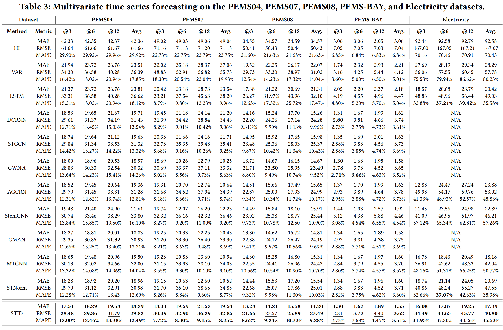

# Spatial-Temporal Identity: A Simple yet Effective Baseline for Multivariate Time Series Forecasting

🔥 ***[New Results] We added the performance of STID on large scale MTS dataset.***

Code for our CIKM'22 short paper: "[Spatial-Temporal Identity: A Simple yet Effective Baseline for Multivariate Time Series Forecasting](https://arxiv.org/abs/2208.05233)".

Our code is built on [BasicTS](https://github.com/zezhishao/BasicTS), an open-source standard time series forecasting benchmark. You can also find STID in [BasicTS](https://github.com/zezhishao/BasicTS). We strongly recommend you use [BasicTS](https://github.com/zezhishao/BasicTS) to reproduce the performance of STID on any dataset, and find more baselines and more detailed comparisons.


> Multivariate Time Series (MTS) forecasting plays a vital role in a wide range of applications. Recently, Spatial-Temporal Graph Neural Networks (STGNNs) have become increasingly popular MTS forecasting methods due to their state-of-the-art performance. However, recent STGNN-based methods are becoming more sophisticated with limited performance improvements. This phenomenon motivates us to explore the critical factors of MTS forecasting and design a model that is as powerful as STGNNs, but more concise and efficient. In this paper, we identify the indistinguishability of samples in both spatial and temporal dimensions as a key bottleneck, and propose a simple yet effective baseline for MTS forecasting by attaching Spatial and Temporal IDentity information (STID). STID achieves the best performance and efficiency simultaneously based on simple multi-layer perceptrons (MLPs). These results suggest that by solving the indistinguishability of samples, we can design models more freely, without being limited to STGNNs.

## 📚 Table of Contents

```text
basicts   --> The BasicTS, which provides standard pipelines for training MTS forecasting models. Don't worry if you don't know it, because it doesn't prevent you from understanding STID's code.

datasets  --> Raw datasets and preprocessed data

figures   --> Some figures used in README.

scripts   --> Data preprocessing scripts.

stid/stid_arch      --> The implementation of STID.

stid/STID_${DATASET_NAME}.py    --> Training configs.
```

Replace `${DATASET_NAME}` with one of `PEMS03`, `PEMS04`, `PEMS07`, `PEMS08`, `METR-LA`, and `PEMS-BAY`.

## 💿Requirements

The code is built based on Python 3.9, PyTorch 1.10.0, and [EasyTorch](https://github.com/cnstark/easytorch).
You can install PyTorch following the instruction in [PyTorch](https://pytorch.org/get-started/locally/). For example:

```bash
pip install torch==1.10.0+cu111 torchvision==0.11.0+cu111 torchaudio==0.10.0 -f https://download.pytorch.org/whl/torch_stable.html
```

After ensuring that PyTorch is installed correctly, you can install other dependencies via:

```bash
pip install -r requirements.txt
```

## 📦 Data Preparation

### **Download Data**

You can download all the raw datasets at [Google Drive](https://drive.google.com/drive/folders/14EJVODCU48fGK0FkyeVom_9lETh80Yjp) or [Baidu Yun](https://pan.baidu.com/s/10gOPtlC9M4BEjx89VD1Vbw)(password: 6v0a), and unzip them to `datasets/raw_data/`.

### **Data Preprocessing**

```bash
cd /path/to/your/project
python scripts/data_preparation/${DATASET_NAME}/generate_training_data.py
```

Replace `${DATASET_NAME}` with one of `METR-LA`, `PEMS-BAY`, `PEMS03`, `PEMS04`, `PEMS07`, `PEMS08`, or any other supported dataset. The processed data will be placed in `datasets/${DATASET_NAME}`.

Or you can pre-process all datasets by.

```bash
cd /path/to/your/project
bash scripts/data_preparation/all.sh
```

## 🎯 Train STID

```bash
python stid/run.py --cfg stid/STID_${DATASET_NAME}.py --gpus '0'
```

Replace `${DATASET_NAME}` with one of `PEMS03`, `PEMS04`, `PEMS07`, `PEMS08`, `METR-LA`, and `PEMS-BAY`, *e.g.*,

```bash
python stid/run.py --cfg stid/STID_PEMS04.py --gpus '0'
```

## 📈 Experiment Results




## 🔗 More Related Works

- [D2STGNN: Decoupled Dynamic Spatial-Temporal Graph Neural Network for Traffic Forecasting. VLDB'22.](https://github.com/zezhishao/D2STGNN)

- [STEP: Pre-training-Enhanced Spatial-Temporal Graph Neural Network For Multivariate Time Series Forecasting. KDD'22.](https://github.com/zezhishao/STEP)

- [BasicTS: An Open Source Standard Time Series Forecasting Benchmark.](https://github.com/zezhishao/BasicTS)

## Citing

```bibtex
@inproceedings{10.1145/3511808.3557702,
author = {Shao, Zezhi and Zhang, Zhao and Wang, Fei and Wei, Wei and Xu, Yongjun},
title = {Spatial-Temporal Identity: A Simple yet Effective Baseline for Multivariate Time Series Forecasting},
year = {2022},
booktitle = {Proceedings of the 31st ACM International Conference on Information & Knowledge Management},
pages = {4454–4458},
location = {Atlanta, GA, USA}
}
```
